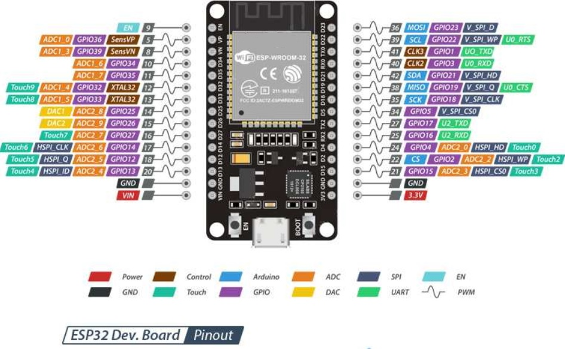
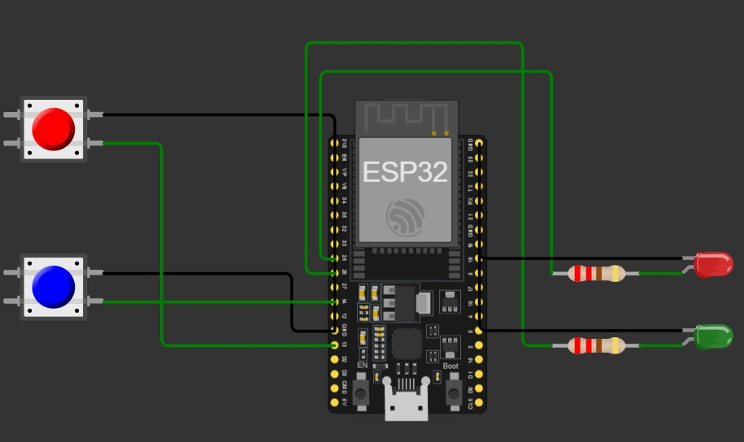

# ESP32-WROOM-32 — Guía Técnica

Repositorio de documentación y proyectos sobre el módulo **ESP32-WROOM-32**, desarrollado como parte de mi formación en ingeniería. Aquí se explica la arquitectura de la placa, sus características de hardware y una comparación entre programarla en **C** (con ESP-IDF/Arduino) y en **MicroPython**.

---

## Tabla de contenido

1. [¿Qué es la ESP32?](#qué-es-la-esp32)
2. [Estructura y arquitectura](#estructura-y-arquitectura)
3. [Características generales](#características-generales)
4. [Pines y conexiones (GPIO)](#pines-y-conexiones-gpio)
5. [ADC (conversor analógico-digital)](#adc-conversor-analógico-digital)
6. [PWM (modulación por ancho de pulso)](#pwm-modulación-por-ancho-de-pulso)
7. [DAC (conversor digital-analógico)](#dac-conversor-digital-analógico)
8. [Programación en C vs. MicroPython](#programación-en-c-vs-micropython)
9. [Ejemplos de código](#ejemplos-de-código)
10. [Recursos y referencias](#recursos-y-referencias)

---

## ¿Qué es la ESP32?

La **ESP32-WROOM-32** es un módulo System-on-Chip (SoC) desarrollado por **Espressif Systems**, orientado a aplicaciones de IoT (Internet de las Cosas). Integra en un solo chip conectividad **Wi-Fi 802.11 b/g/n** y **Bluetooth Classic + BLE (Low Energy)**, junto con un microprocesador de doble núcleo, memoria interna y una gran variedad de periféricos.

Es el sucesor del popular **ESP8266**, y mejora significativamente sus capacidades: más memoria, más pines GPIO, mayor velocidad de reloj, soporte para Bluetooth, y periféricos analógicos (ADC y DAC) que el ESP8266 no tenía.

Se utiliza tanto en proyectos educativos y de prototipado (domótica, sensores IoT, robots, wearables) como en productos comerciales de bajo costo y bajo consumo energético.

---

## Estructura y arquitectura

En el núcleo del módulo ESP32-WROOM-32 está el chip **ESP32-D0WDQ6** (o su variante **ESP32-D0WD**), que contiene:

- **CPU:** dos microprocesadores **Xtensa® de 32 bits LX6** (arquitectura dual-core), identificados como:
  - **PRO_CPU (Core 0):** normalmente dedicado a gestionar la pila de protocolos Wi-Fi/Bluetooth.
  - **APP_CPU (Core 1):** normalmente libre para ejecutar el código de la aplicación del usuario.
  - Ambos núcleos pueden controlarse de forma independiente y trabajar con **frecuencia de reloj ajustable entre 80 MHz y 240 MHz**.
  - Soportan hasta **600 DMIPS** de rendimiento combinado, unidad de punto flotante (FPU) e instrucciones DSP (multiplicador de 32 bits, divisor de 32 bits, MAC de 40 bits).

- **Memoria interna:**
  - 448 KB de ROM (para funciones de arranque y núcleo).
  - 520 KB de SRAM (datos e instrucciones).
  - 8 KB de SRAM en RTC FAST Memory (usada por la CPU principal al despertar del *deep sleep*).
  - 8 KB de SRAM en RTC SLOW Memory (accesible por el coprocesador ULP durante el modo de bajo consumo).
  - 1 kbit de eFuse (parte reservada para MAC address y configuración del chip).

- **Memoria externa (en el módulo):** 4 MB de memoria flash SPI externa (varía según el modelo: 4, 8 o 16 MB).

- **Coprocesador de bajo consumo (ULP):** permite monitorear sensores y periféricos mientras la CPU principal está apagada, ideal para aplicaciones de bajo consumo energético.

- **Bloques funcionales integrados:** controlador Wi-Fi (MAC + banda base + RF), controlador Bluetooth (banda base + link controller), aceleración criptográfica por hardware (AES, SHA, RSA), generador de números aleatorios (RNG), temporizadores, y todos los periféricos digitales/analógicos (I2C, I2S, SPI, UART, SDIO, PWM, ADC, DAC, sensores táctiles, etc.), todos conectados a través de una matriz de buses interna que distribuye las señales hacia los pines GPIO físicos.

**Diagrama conceptual simplificado:**

```
        ┌───────────────────────────────────────────┐
        │              ESP32-D0WDQ6 (SoC)            │
        │                                             │
        │   ┌───────────┐        ┌───────────┐       │
        │   │ PRO_CPU    │        │ APP_CPU    │       │
        │   │ (Core 0)   │◄──────►│ (Core 1)   │       │
        │   │ Xtensa LX6 │        │ Xtensa LX6 │       │
        │   └─────┬──────┘        └─────┬──────┘       │
        │         │                     │              │
        │   ┌─────▼─────────────────────▼──────┐       │
        │   │        Bus / memoria (SRAM, ROM)   │      │
        │   └─────┬───────────────────────┬─────┘       │
        │         │                       │              │
        │  ┌──────▼──────┐        ┌───────▼──────┐       │
        │  │ Wi-Fi/BT RF  │        │ Periféricos   │      │
        │  │ (MAC+PHY)    │        │ ADC/DAC/PWM/  │      │
        │  │              │        │ I2C/SPI/UART  │      │
        │  └──────────────┘        └───────┬──────┘       │
        └───────────────────────────────────┼──────────────┘
                                             │
                                     Pines GPIO (hacia el mundo exterior)
```

---

## Características generales

| Característica | Detalle |
|---|---|
| Fabricante | Espressif Systems |
| CPU | Dual-core Xtensa® 32-bit LX6, hasta 240 MHz |
| Rendimiento | Hasta 600 DMIPS |
| Memoria SRAM | 520 KB |
| Memoria ROM | 448 KB |
| Memoria Flash externa | 4 MB (típico en WROOM-32; varía según modelo) |
| Conectividad Wi-Fi | 802.11 b/g/n (2.4 GHz) |
| Conectividad Bluetooth | Bluetooth v4.2 BR/EDR + BLE |
| GPIO totales del chip | Hasta 34 pines multiplexables (el módulo WROOM-32 expone 25-30 según la placa de desarrollo) |
| Voltaje de operación | 3.3 V (pines **no tolerantes a 5 V**) |
| Consumo típico | ~80 mA (activo) |
| Temperatura de trabajo | -40 °C a +85 °C |
| Seguridad | Aceleración criptográfica AES, SHA, RSA; Secure Boot; cifrado de flash |
| Interfaces de comunicación | UART (3), SPI (3, una reservada para flash), I2C (2, asignables por software), I2S (2), SDIO |
| Sensores integrados | Sensor de temperatura interno, sensor Hall, 10 canales táctiles capacitivos |

---

## Pines y conexiones (GPIO)

El ESP32 utiliza una **matriz de GPIO (GPIO Matrix)** que permite reasignar por software casi cualquier función periférica (I2C, SPI, UART, PWM) a casi cualquier pin físico, lo cual da mucha flexibilidad de diseño.

**Diagrama de pinout de referencia (placa de desarrollo ESP32-WROOM-32, 38 pines):**



> Fuente de la imagen: [descubrearduino.com](https://descubrearduino.com/wp-content/uploads/2020/06/ESP32-pinout.jpg). Se usa aquí con fines educativos, con crédito al autor original.
>
> Para que la imagen se muestre correctamente, descárgala y colócala en tu repositorio en la ruta `img/esp32-pinout.jpg`.

Puntos clave a tener en cuenta al conectar la placa:

- **Voltaje lógico:** 3.3 V. Los pines **no son tolerantes a 5 V**; conectar una señal de 5 V directamente puede dañar el chip.
- **Pines de solo entrada:** GPIO 34, 35, 36 y 39 no tienen resistencias internas de pull-up/pull-down y no pueden usarse como salida.
- **Pines reservados (no usar):** GPIO 6 a 11 están conectados internamente a la memoria flash SPI integrada; usarlos normalmente impide el arranque del módulo.
- **Pines de *strapping* (arranque):** GPIO 0, 2, 5, 12 y 15 determinan el modo de arranque (programación o ejecución normal). Deben manejarse con cuidado si se conectan periféricos externos, ya que un nivel incorrecto en el reset puede impedir que la placa inicie.
- **Corriente máxima recomendada:** ~12 mA por pin.
- **Interrupciones:** prácticamente cualquier GPIO puede configurarse como fuente de interrupción.

---

## ADC (conversor analógico-digital)

La ESP32-WROOM-32 dispone de **dos bloques ADC de aproximación sucesiva (SAR) de hasta 12 bits de resolución** (4096 niveles discretos), organizados así:

| Bloque | Canales | Pines típicos (GPIO) | Disponibilidad con Wi-Fi |
|---|---|---|---|
| **ADC1** | 8 canales | 32, 33, 34, 35, 36, 37, 38, 39 | ✅ Disponible siempre |
| **ADC2** | 10 canales | 0, 2, 4, 12, 13, 14, 15, 25, 26, 27 | ⚠️ **No disponible** mientras el Wi-Fi está activo (el driver de Wi-Fi usa el mismo hardware) |

**Recomendación práctica:** si el proyecto usa Wi-Fi, todas las lecturas analógicas deben hacerse por **ADC1**, ya que ADC2 queda bloqueado por el controlador inalámbrico.

Con 12 bits de resolución, el rango de lectura va de 0 a 4095, correspondiente a un voltaje de entrada configurable (típicamente 0–3.3 V mediante atenuación ajustable). Es importante calibrar el ADC si se requiere precisión, ya que presenta cierta no linealidad, especialmente en los extremos del rango.

---

## PWM (modulación por ancho de pulso)

La generación de PWM se realiza mediante el periférico **LEDC (LED Control)**:

- Ofrece **16 canales de PWM independientes** (8 de alta velocidad y 8 de baja velocidad, según la revisión del chip).
- Puede generarse en **casi cualquier pin GPIO** que funcione como salida (los pines de solo entrada 34-39 no pueden emitir PWM).
- Resolución configurable de hasta **16 bits** (permite un control muy fino del ciclo de trabajo).
- Frecuencia ajustable desde pocos Hz hasta decenas de MHz.
- Usos típicos: control de motores, atenuación (*dimming*) de LEDs, generación de señales para servomotores.

> Nota: en ESP32 no existe la función `analogWrite()` nativa de Arduino clásico; en su lugar se configura el periférico LEDC (tanto en ESP-IDF como en el core de Arduino para ESP32).

---

## DAC (conversor digital-analógico)

El chip incluye **2 canales DAC de 8 bits**, capaces de generar una salida de voltaje analógico real (no simulada por PWM):

| Canal | Pin (GPIO) | Resolución | Rango de salida |
|---|---|---|---|
| DAC1 | GPIO 25 | 8 bits (0-255) | 0 – 3.3 V |
| DAC2 | GPIO 26 | 8 bits (0-255) | 0 – 3.3 V |

Se utilizan para generar formas de onda simples, tensiones de referencia, audio básico de baja fidelidad o como "potenciómetro digital". Su resolución de 8 bits es limitada para aplicaciones de audio de alta calidad, donde suele preferirse un DAC externo.

---

## Programación en C vs. MicroPython

La ESP32 puede programarse principalmente de dos formas: en **C/C++** (usando el framework oficial **ESP-IDF** o el núcleo de **Arduino**), o en **MicroPython** (un intérprete de Python que corre directamente sobre el chip).

### Programar en C (ESP-IDF / Arduino)

**Ventajas:**
- Acceso completo y de bajo nivel al hardware (registros, interrupciones, DMA).
- Mejor rendimiento y menor uso de memoria: el código compilado es más rápido y eficiente que un intérprete.
- Mayor control sobre el consumo energético y los modos de bajo consumo (*deep sleep*, *light sleep*).
- Es el entorno "nativo" del fabricante (ESP-IDF), por lo que recibe soporte y actualizaciones más completas.
- Ideal para proyectos que requieren temporización precisa o procesamiento intensivo (audio, señales en tiempo real).

**Desventajas:**
- Curva de aprendizaje más pronunciada, especialmente para quienes no tienen experiencia previa en programación de bajo nivel.
- El ciclo de desarrollo es más lento: hay que compilar y flashear el binario completo tras cada cambio.
- La gestión manual de memoria puede generar errores difíciles de depurar (fugas de memoria, punteros inválidos).
- Requiere configurar un entorno de compilación (toolchain) más complejo.

### Programar en MicroPython

**Ventajas:**
- Sintaxis simple y legible, ideal para prototipado rápido y para quienes están aprendiendo.
- Permite ejecutar código línea por línea mediante un REPL interactivo, sin necesidad de recompilar todo el programa.
- Reduce significativamente el tiempo de desarrollo en proyectos pequeños o educativos.
- Buena disponibilidad de bibliotecas de alto nivel para sensores y módulos comunes.

**Desventajas:**
- Menor rendimiento: al ser interpretado, es más lento que el código en C compilado, lo que puede ser crítico en tareas que requieren temporización muy precisa.
- Mayor consumo de memoria RAM, lo que puede limitar proyectos complejos o con muchas dependencias.
- Acceso más limitado al hardware de bajo nivel comparado con ESP-IDF.
- El soporte de algunas funciones avanzadas (ciertos periféricos o modos de energía) puede ir por detrás del soporte oficial en C.

### Resumen comparativo

| Criterio | C (ESP-IDF / Arduino) | MicroPython |
|---|---|---|
| Velocidad de ejecución | Alta | Media/Baja |
| Facilidad de aprendizaje | Media/Baja | Alta |
| Velocidad de desarrollo | Lenta (compilar y flashear) | Rápida (REPL interactivo) |
| Consumo de RAM | Bajo | Más alto |
| Control de hardware | Total | Limitado |
| Ideal para | Proyectos de producción, tiempo real, bajo consumo | Prototipado, aprendizaje, proyectos educativos |

---

## Ejemplos de código

El repositorio incluye un proyecto de ejemplo (control de dos LEDs mediante interrupciones de botón, con una tarea productora/consumidora comunicadas por una cola) implementado en ambos lenguajes, para comparar en la práctica lo descrito en la sección anterior:

| Lenguaje | Carpeta | Simulación online | Descripción |
|---|---|---|---|
| C (ESP-IDF / FreeRTOS) | [`src/c/`](src/c/) | [Wokwi ↗](https://wokwi.com/projects/471963365838170113) | Versión original con tareas, colas y semáforos nativos de FreeRTOS |
| MicroPython | [`src/micropython/`](src/micropython/) | [Wokwi ↗](https://wokwi.com/projects/473197046830440449) | Versión equivalente, con explicación detallada del código en su propio `README.md` |

Ambas versiones comparten el mismo circuito (dos botones en GPIO13/GPIO14, dos LEDs con resistencia en GPIO25/GPIO26):



---

## Recursos y referencias

- Hoja de datos oficial: [ESP32-WROOM-32 Datasheet – Espressif Systems](https://www.espressif.com/sites/default/files/documentation/esp32-wroom-32_datasheet_en.pdf)
- Documentación oficial: [ESP-IDF Programming Guide](https://docs.espressif.com/projects/esp-idf/en/latest/esp32/)
- Firmware MicroPython: [micropython.org – ESP32](https://micropython.org/download/esp32/)

---

*Repositorio elaborado con fines académicos como parte de mi formación en ingeniería.*
